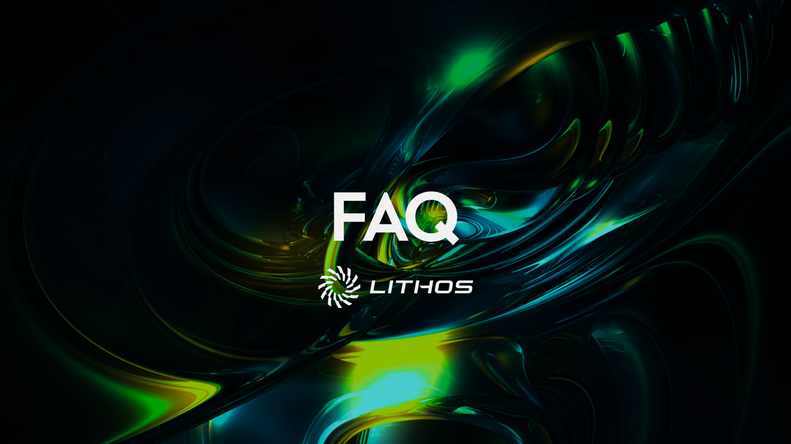

# FAQ

<figure><figcaption></figcaption></figure>

#### What is ve(3,3)?

ve(3,3) is the tokenomics model Lithos is built on. It combines Curve’s vote-escrow system (locking tokens for voting power) with Olympus DAO’s (3,3) game theory for aligned incentives. The result is a system where traders, liquidity providers, and governance participants all benefit when they cooperate for long-term growth.

#### What is veLITH?

veLITH is the governance token of Lithos. Users lock LITH for up to four years to mint veLITH as an NFT. The longer the lock, the more voting power you receive. veLITH holders vote on gauges, direct emissions, and earn rewards from fees, bribes, and anti-dilution rebases.

#### What are gauges?

Gauges are smart contracts that distribute LITH emissions to liquidity pools. veLITH holders vote on which gauges receive emissions each week. Pools with more votes and incentives get more emissions, which attracts more liquidity.

#### What are voting incentives (bribes)?

Voting incentives are tokens deposited into gauges by protocols or participants to attract votes from veLITH holders. If you vote for a pool with incentives, you can claim those tokens after the Epoch ends.

#### What is an Epoch?

An Epoch is a 7-day cycle, from Thursday to Thursday (reset at 00:00 UTC). Votes, emissions, and incentives all operate on this cycle. At the end of each Epoch, rewards are distributed to veLITH voters.

#### How do I earn rewards?

You can earn rewards by:

* Providing liquidity and collecting swap fees.
* Staking LP tokens in a gauge to receive emissions and incentives.
* Locking LITH into veLITH, voting each Epoch, and claiming fees, bribes, and rebases.

#### What is Protocol-Owned Liquidity (POL)?

POL is liquidity seeded and owned by Lithos. It ensures that core pairs (e.g. USDT/USDC, LITH/XPL) always have deep liquidity, reducing reliance on mercenary capital and stabilizing trading conditions.

#### What happens when my veLITH lock expires?

Once the lock expires, your veLITH balance goes to zero and the original LITH becomes available to withdraw. You can relock LITH at any time to continue participating in governance and rewards.

#### What risks should I know about?

* **Impermanent Loss**: Providing liquidity to volatile pairs may expose you to price divergence risk.
* **Smart Contract Risk**: Although Lithos is built on audited contracts, all DeFi carries risk.
* **Governance Risk**: veLITH holders decide emissions, which means vote buying and incentives can shift rewards between pools.

#### How are fees distributed?

Trading fees are collected from swaps and distributed across liquidity providers and veLITH voters, depending on pool setup and gauge emissions.

#### How do emissions work?

Weekly LITH emissions are directed by veLITH votes. Liquidity providers earn these emissions by staking in gauges. A portion (30%) of emissions is distributed to veLITH holders as a rebase to prevent dilution.
